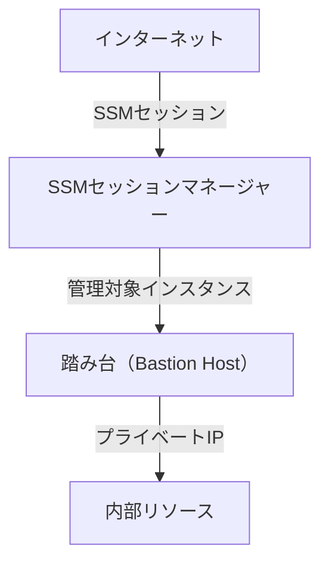
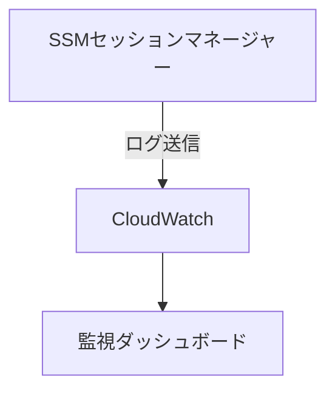
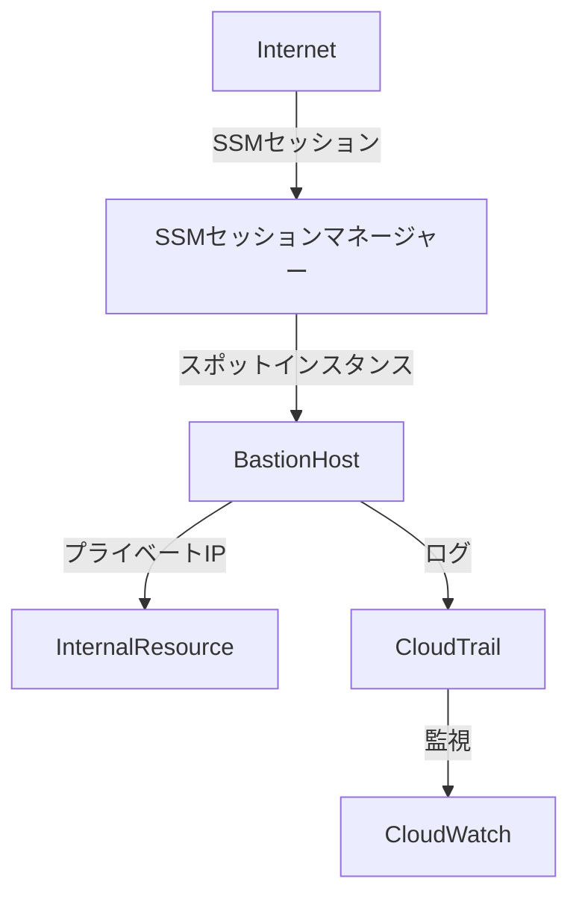

# AWSの踏み台設計: ベストプラクティスと低コストアプローチ
こんにちは。AWSを活用している皆さんにとって、セキュリティの確保は重要な課題ですよね。今回は、AWSにおける踏み台（Bastion Host）設計のベストプラクティスと、低コストで運用する方法について紹介します。以下の情報は、個人の調査に基づいており、具体的な導入や運用には最新の公式ドキュメントや専門家のアドバイスも参考にしてください。

## 前提条件

- **OS**: Amazon Linux 2023
- **AWSサービス**: EC2, SSM（Systems Manager）, CloudTrail, CloudWatch
- **目的**: セキュアな踏み台設計の実現とコスト削減

## 踏み台の役割とは？

踏み台は、外部からのアクセスを制限しつつ、内部リソースに安全にアクセスするための中継サーバです。具体的には以下の役割を果たします：

- **セキュリティの向上**：直接的なアクセスを防ぎ、アクセスログを集中管理します。
- **アクセス制御**：内部リソースへのアクセスを一元化し、管理が容易になります。

## ベストプラクティスに基づいた設計

### 1. セキュアなネットワーク設定

SSM（Systems Manager）セッションマネージャーを使うことで、踏み台サーバを介さずにEC2インスタンスにアクセスできます。これにより、公開IPアドレスやSSHポートを開放せずに済み、セキュリティが向上します。

### 2. IAMロールの利用

AWSが提供するマネージドポリシーを使います。SSMセッションマネージャーに必要な最低限の権限を持つポリシー（`AmazonSSMManagedInstanceCore`）を使用し、このポリシーを持つIAMロールを作成して対象のEC2インスタンスに割り当てます。

### 3. ログの管理

CloudTrailとCloudWatchを使ってアクセスログを収集し、監視と監査を行います。

## 低コストでの運用

### オートスケーリングとスポットインスタンスの活用

踏み台サーバは必要な時にだけ稼働させ、不要時には停止することでコストを削減できます。以下は具体的な手順です：

1. **オートスケーリンググループの設定**：
    - **起動テンプレートの作成**：スポットインスタンスを使う起動テンプレートを作成します。
    - **オートスケーリングポリシーの設定**：必要な時に自動的に起動・停止するように設定します。例えば、業務時間内のみ稼働させるように設定できます。

2. **スポットインスタンスの設定**：
    - **スポットリクエストの作成**：踏み台サーバとして使うスポットインスタンスのリクエストを設定します。これにより、通常のオンデマンドインスタンスよりも安価に利用できます。

3. **SSMセッションマネージャーとの連携**：
    - **SSMエージェントのインストール**：起動テンプレートにSSMエージェントをインストールするスクリプトを追加します。
    - **SSMセッションの設定**：セッションマネージャーを使って踏み台サーバにアクセスするように設定します。

以下に、設計例を示します。図を使って視覚的に理解しやすくします。

## ベストプラクティスを満たしているか

| 項目                           | 実装方法                                         | ベストプラクティスとの一致度     |
|------------------------------|-----------------------------------------------|----------------------------|
| セキュアなネットワーク設定       | SSMセッションマネージャーを使用して直接アクセス | 非公開IP・SSHポート不要      |
| 最小権限の原則                | AWS提供のマネージドポリシーを使用              | 権限の最小化                 |
| ログ管理                      | CloudTrailおよびCloudWatchを使用               | 完全なログ収集と監視         |
| オートスケーリング            | 必要時にのみ起動・停止する設定                  | リソースの効率的な利用        |
| スポットインスタンスの活用       | コスト削減のためにスポットインスタンスを利用     | 低コスト運用                 |

## まとめ

AWSの踏み台設計において、ベストプラクティスを遵守しつつ、コストを抑える方法をご紹介しました。SSMセッションマネージャーの活用により、セキュアかつ効率的なアクセスを実現し、オートスケーリングとスポットインスタンスの組み合わせによりコストを最小限に抑えることが可能です。

AWS環境でのセキュリティとコスト効率を両立させるために、ぜひ本記事の内容を参考にしてみてください。

このブログ記事は個人の調査に基づいて書かれています。具体的な導入や運用に際しては、最新の公式ドキュメントや専門家のアドバイスを参照してください。

このブログ記事が役に立った場合、ぜひZennの「いいね」やシェアをお願いします。また、コメントでのフィードバックもお待ちしております！

## 参考文献
- [AWS Systems Manager ドキュメント](https://docs.aws.amazon.com/ja_jp/systems-manager/latest/userguide/ssm-agent.html)
- [AWS CloudTrail ドキュメント](https://docs.aws.amazon.com/ja_jp/cloudtrail/latest/userguide/cloudtrail-user-guide.html)
- [AWS CloudWatch ドキュメント](https://docs.aws.amazon.com/ja_jp/cloudwatch/latest/monitoring/WhatIsCloudWatch.html)
- [Amazon EC2 スポットインスタンスの使用方法](https://aws.amazon.com/jp/ec2/spot/)
