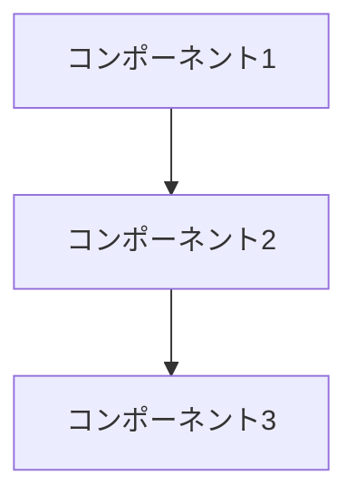
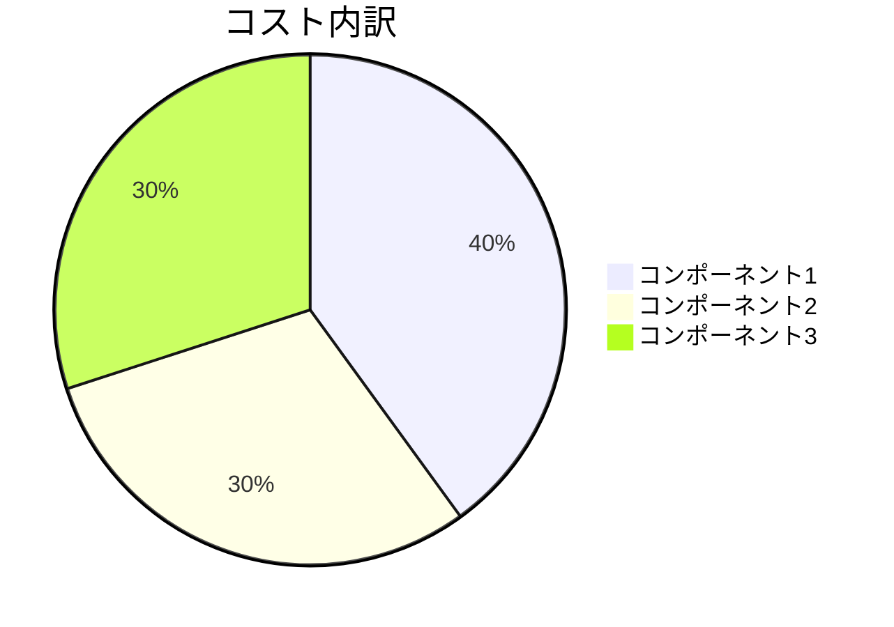

## はじめに

:::message
この記事では、〇〇の基本概念から実践的な使い方まで、
わかりやすく解説していきます。
:::

## 〇〇とは

### 概要と特徴

〇〇は、以下のような特徴を持つサービス/技術です：

1. 特徴1
2. 特徴2
3. 特徴3

### 主なユースケース

:::details 一般的な利用シーン
- ユースケース1
  - 具体例
  - メリット
- ユースケース2
  - 具体例
  - メリット
:::

## アーキテクチャ

### 基本構成



*基本的なアーキテクチャ構成*

### 主要コンポーネント

1. コンポーネント1
   - 役割
   - 特徴
   - 注意点

2. コンポーネント2
   - 役割
   - 特徴
   - 注意点

## 重要な概念

### 概念1

:::message
重要な概念の説明と、それが必要な理由について解説します。
:::

```typescript:概念の例
// コードで理解する例
const example = {
  concept1: "value1",
  concept2: "value2"
};
```

### 概念2

実際のユースケースと共に説明：

1. ユースケース
   - 具体例
   - 実装方法
   - 注意点

2. ベストプラクティス
   - 推奨設定
   - アンチパターン

## セキュリティ考慮事項

### セキュリティモデル

:::message alert
セキュリティ上の重要なポイントを解説します：
:::

1. 認証
   - 仕組み
   - 実装方法
   - ベストプラクティス

2. 認可
   - アクセス制御
   - 権限管理
   - 監査

## パフォーマンスとスケーリング

### パフォーマンス最適化

| 観点 | 推奨設定 | 注意点 |
| ---- | -------- | ------ |
| 項目1 | 設定値 | 解説 |
| 項目2 | 設定値 | 解説 |

### スケーリング戦略

:::details スケーリングのベストプラクティス
1. 水平スケーリング
   - メリット
   - デメリット
   - 実装方法

2. 垂直スケーリング
   - メリット
   - デメリット
   - 実装方法
:::

## コスト最適化

### コスト構造



### 最適化戦略

1. 短期的な対策
   - 実施項目
   - 期待効果
   - 注意点

2. 長期的な対策
   - 実施項目
   - 期待効果
   - 注意点

## まとめ

:::message
この記事で解説した重要なポイント：

1. 基本概念と特徴
2. アーキテクチャの理解
3. セキュリティとパフォーマンス
:::

## 参考文献

1. [公式ドキュメント](https://docs.aws.amazon.com/)
2. [ベストプラクティスガイド](https://aws.amazon.com/architecture/)
3. [関連する技術記事](https://aws.amazon.com/blogs/)

---

:::details 更新履歴
- YYYY/MM/DD: 記事作成
- YYYY/MM/DD: 概念の説明を追加
:::

:::message
さらに詳しく知りたい方へ：
- [関連サービスの解説]()
- [実践的なチュートリアル]()
- [ベストプラクティスガイド]()
::: 